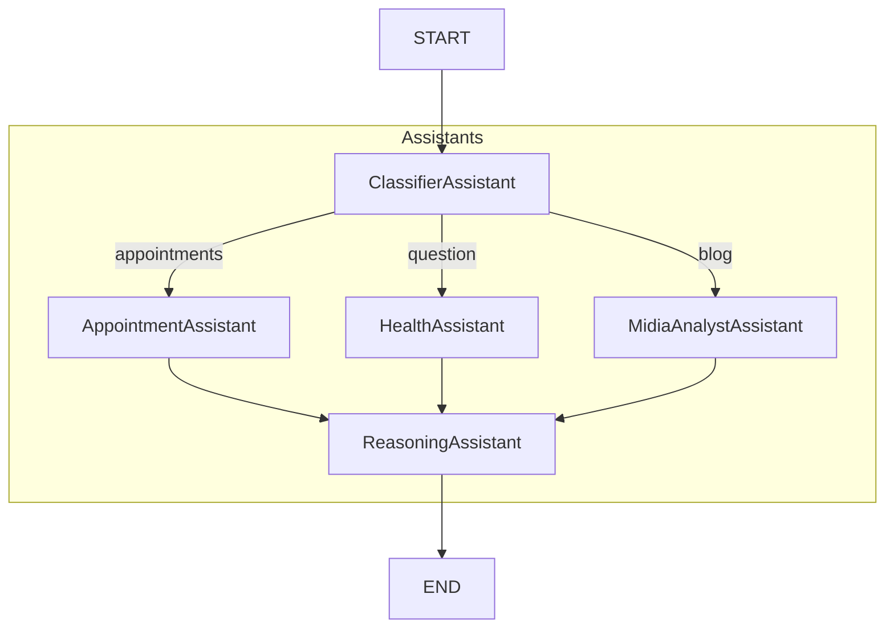

```mermaid
graph TD
    START --> classify
    classify -->|appointments| appointments
    classify -->|question| question
    classify -->|blog| blog
    appointments --> synthesize
    question --> synthesize
    blog --> synthesize
    synthesize --> END

    subgraph Assistants
        classify[ClassifierAssistant]
        appointments[AppointmentAssistant]
        question[HealthAssistant]
        blog[MidiaAnalystAssistant]
        synthesize[ReasoningAssistant]
    end
```
